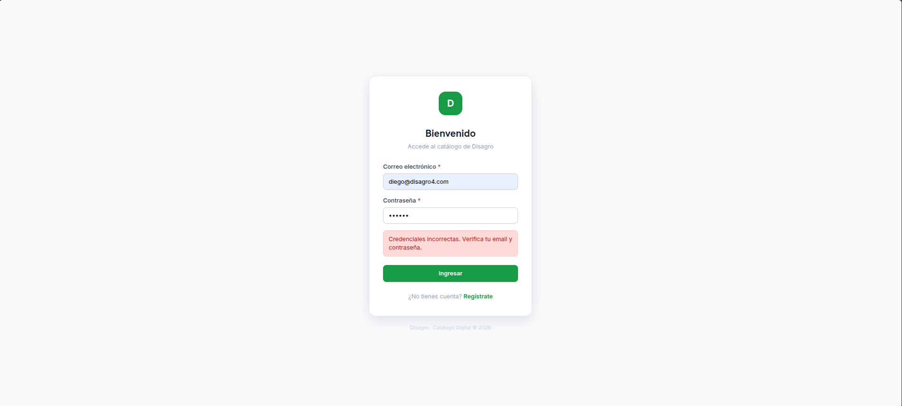
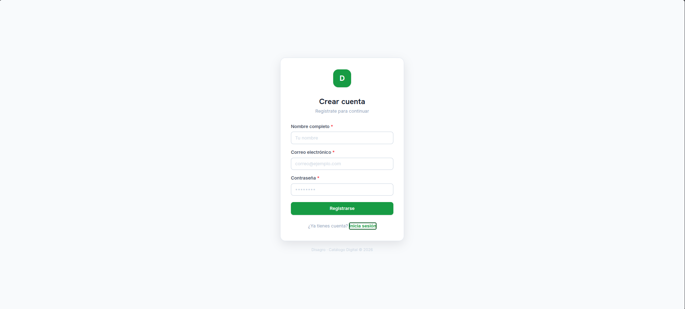
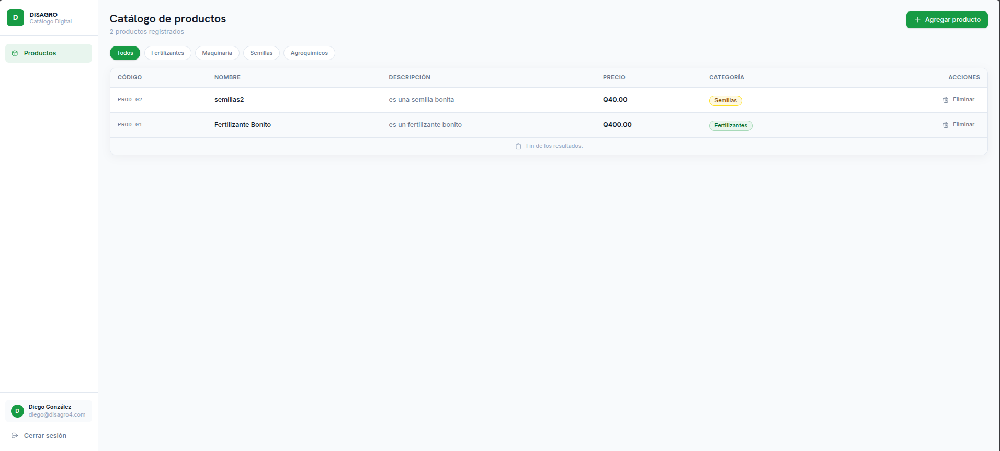

# Manual de Usuario - Catálogo Digital Disagro

## 1. Introducción al Sistema
El **Catálogo Digital de Disagro** es una plataforma web orientada a la gestión y visualización de inventario agrícola. El sistema permite a los administradores mantener un registro ordenado, categorizado y seguro de los diferentes productos que maneja la empresa.

---

## 2. Acceso al Sistema (Autenticación)

Para garantizar la seguridad de la información, el sistema es privado y requiere autenticación.

### 2.1. Iniciar Sesión (Login)
Al ingresar a la plataforma, se visualizará una pantalla de bienvenida.
1. Ingrese su **Correo electrónico** registrado.
2. Ingrese su **Contraseña**.
3. Haga clic en el botón verde **"Ingresar"**.

### 2.2. Registro de Nuevo Usuario
Si es la primera vez que utiliza el sistema:
1. En la pantalla de login, haga clic en el texto inferior **"Regístrate"**.
2. Complete los campos obligatorios: **Nombre completo**, **Correo electrónico** y una **Contraseña** (mínimo 6 caracteres).
3. Haga clic en **"Registrarse"**. El sistema lo ingresará automáticamente al finalizar.

---

## 3. Interfaz Principal (Dashboard)

Una vez iniciada la sesión, será redirigido al panel principal. La pantalla se divide en dos secciones fundamentales:

### 3.1. Panel Lateral (Sidebar)
Ubicado a la izquierda, contiene la información institucional:
*   **Logo de Disagro.**
*   **Menú de Navegación:** Contiene el acceso directo al módulo de **"Productos"**.
*   **Información de Sesión:** En la parte inferior, se muestra el nombre y correo del usuario activo, junto con el botón **"Cerrar sesión"** para salir del sistema de forma segura.

### 3.2. Área de Trabajo
Ocupa la mayor parte de la pantalla (área derecha) y es donde se visualizan y manipulan los datos del catálogo.

---

## 4. Gestión de Productos

### 4.1. Visualización del Catálogo
El sistema carga automáticamente todos los productos registrados, mostrando una tabla con la siguiente información:
*   Código del producto
*   Nombre y Descripción
*   Precio (En Quetzales, con formato Q0.00)
*   Categoría (Identificada visualmente por colores distintos)

### 4.2. Filtrado Rápido
Justo arriba de la tabla, encontrará botones o "pills" con las categorías disponibles (Ej. *Fertilizantes, Maquinaria, Semillas, Agroquímicos*).
*   Al hacer clic en uno de estos botones, la tabla mostrará **únicamente** los productos pertenecientes a esa categoría.
*   Al hacer clic en **"Todos"**, se mostrará el catálogo completo nuevamente.

### 4.3. Agregar un Nuevo Producto
Para ingresar mercadería al catálogo:
1. En la parte superior derecha de la pantalla, haga clic en el botón verde **"Agregar producto"**.
2. Se desplegará un formulario integrado en la misma página.
3. Llene los datos requeridos:
    *   **Código:** Identificador único (Ej: FRT-01).
    *   **Nombre:** Nombre comercial.
    *   **Descripción:** Detalle del producto (mínimo 10 caracteres).
    *   **Precio:** Valor numérico mayor a cero.
    *   **Categoría:** Seleccione una opción del menú desplegable.
4. Haga clic en **"Guardar producto"**. La tabla se actualizará instantáneamente mostrando el nuevo registro.

### 4.4. Eliminar un Producto
Si requiere dar de baja un ítem del catálogo:
1. Localice el producto en la tabla.
2. En la última columna (Acciones), haga clic en el botón de la papelera que dice **"Eliminar"**.
3. El producto se removerá del sistema de inmediato.
